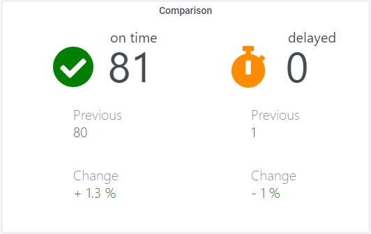

# Comparison Panel

## Required queries and query names

Query name | query
--- | ---
**total-filtered** | increase(application_flows_state_total{status="success"}[${__range}])
**total-right-filtered** | increase(application_flows_state_total{status="timeout"}[${__range}])
**previous-filtered** | increase(application_flows_state_total{status="success"}[${__range}] offset ${__range})
**previous-right-filtered** | increase(application_flows_state_total{status="timeout"}[${__range}] offset ${__range})

**The query names are mandatory.**

The filtered status (success, warning, error or timeout) is responsible for the styling of the panel in relation to the
main icon and the trend color of change.
